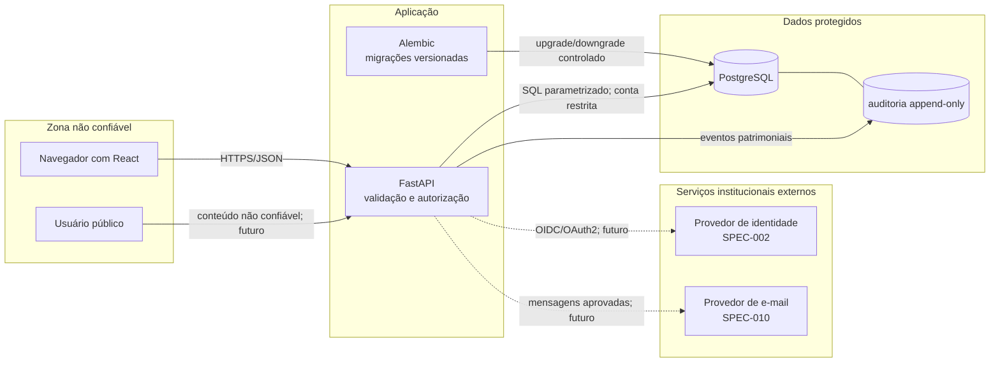

# Arquitetura da fundação

Este documento descreve a base aprovada pela SPEC-001 e as extensões implementadas
até a SPEC-013. A interface React, a API FastAPI, a persistência PostgreSQL,
autenticação local, inventário, movimentação, comunicação pública, ocorrências,
manutenções, planejamento, alertas, painel, relatórios e recomendações de falha
estão implementados. O
adaptador de identidade institucional e o envio de e-mail real continuam fora do
escopo.

## Componentes e fronteiras de confiança

Cada seta que cruza uma zona é uma fronteira de confiança. Entradas vindas do
navegador, de links públicos, do provedor de identidade e de integrações devem ser
validadas como dados não confiáveis. O banco não é acessível diretamente pelo
frontend.

## Responsabilidades

| Componente | Responsabilidade | Não pode decidir |
|---|---|---|
| React | Apresentação e acessibilidade; consome contratos HTTP | Autorização ou transição patrimonial |
| FastAPI | Valida entrada, aplica regras determinísticas e expõe OpenAPI | Aprovar custos ou substituir decisão humana |
| SQLAlchemy/Alembic | Persistência e evolução reversível do esquema | Executar migração destrutiva automaticamente |
| PostgreSQL | Integridade relacional e proteção append-only da auditoria | Expor dados diretamente ao cliente |
| Provedor de identidade | Autenticação institucional futura | Autorizar operações sem regras da API |

## Contrato HTTP inicial

O contrato versionado está em [`openapi.json`](openapi.json). Ele contém os
diagnósticos, as rotas de sessão e os contratos das SPEC-003 a SPEC-013. Cada
rota protegida aplica autorização no servidor; o fluxo público é limitado ao
formulário de comunicação e ao acompanhamento neutro. Alertas usam apenas o
provedor mock, custos permanecem informativos sem aprovação ou pagamento, e a
SPEC-013 usa baseline determinístico inicialmente desabilitado, com abstenção e
supervisão humana.

## Configuração e segredos

- `DATABASE_URL` é obrigatória e vem do ambiente ou de `.env` ignorado pelo Git.
- Arquivos `.env.example` contêm somente valores fictícios de desenvolvimento.
- Erros de conectividade retornam mensagem genérica; a URL e a exceção interna
  não fazem parte da resposta.
- Produção, backup, retenção, TLS e gestão de segredos exigem decisão humana
  posterior.

## Rastreabilidade

- Modelo conceitual: [`modelo-dados.md`](modelo-dados.md).
- Matriz de autorização e sessão: [`matriz-autorizacao.md`](matriz-autorizacao.md).
- Ameaças e controles: [`modelo-ameacas.md`](modelo-ameacas.md).
- Decisões: [`adr/ADR-001-fundacao-tecnica.md`](adr/ADR-001-fundacao-tecnica.md).
- Migração inicial: `inventario_backend/migrations/versions/20260915_0001_initial_schema.py`.

