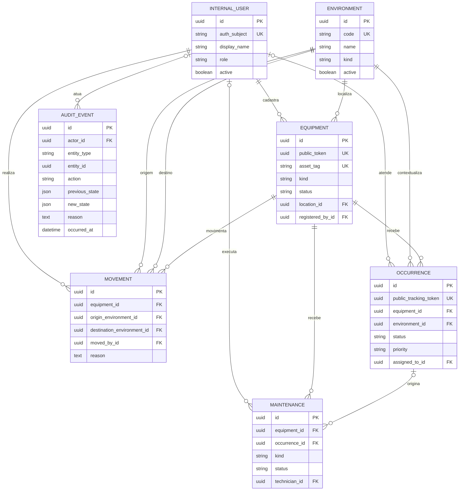

# Modelo conceitual de dados

O modelo cobre as entidades mínimas do desafio sem antecipar regras funcionais das
specs seguintes. Identificadores são UUIDs gerados no servidor. Tokens públicos são
separados das chaves internas para reduzir enumeração e acoplamento.

## Invariantes da fundação

- Equipamento referencia um ambiente e o usuário que realizou o cadastro.
- Uma movimentação exige origem distinta do destino, ator e justificativa.
- Ocorrências e manutenções usam estados limitados por `CHECK` no banco.
- Mudanças patrimoniais devem produzir `audit_events` com ator, instante,
  justificativa e estados anterior/novo; a gravação transacional será feita pelos
  serviços das specs funcionais.
- `audit_events` rejeita `UPDATE` e `DELETE` por trigger. Correções são novos
  eventos, nunca alterações do histórico.
- Chaves estrangeiras usam `RESTRICT` para impedir exclusão silenciosa de
  histórico.

## Dados pessoais e retenção

`display_name` e `auth_subject` são dados pessoais e ficam na zona protegida. Logs e
auditoria devem preferir o identificador interno e não copiar nomes, credenciais ou
tokens. Política de retenção, anonimização e backup permanece pendente de decisão
institucional antes da produção.

