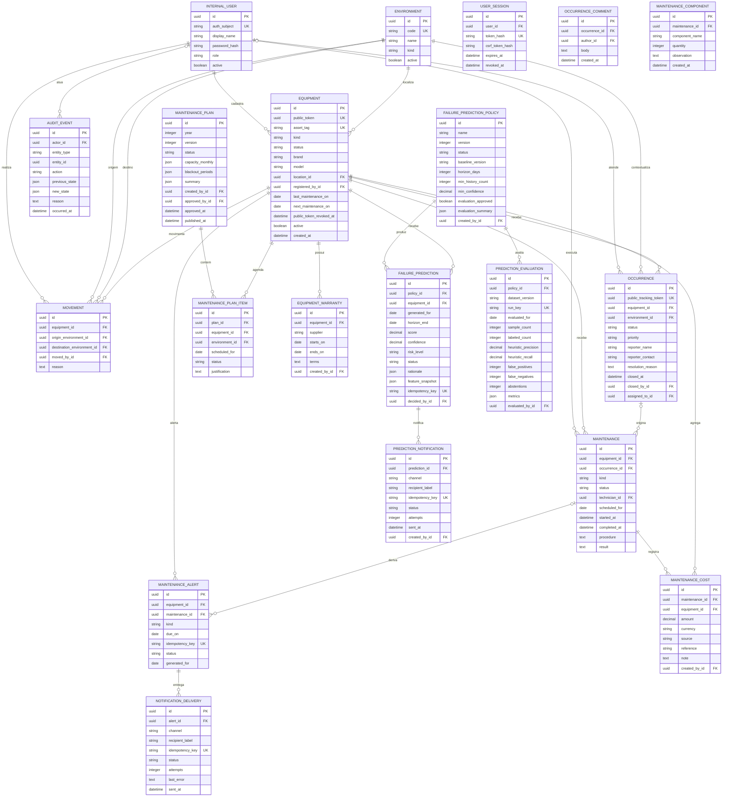

# Modelo conceitual de dados

O modelo cobre as entidades mínimas do desafio sem antecipar regras funcionais das
specs seguintes. Identificadores são UUIDs gerados no servidor. Tokens públicos são
separados das chaves internas para reduzir enumeração e acoplamento.

`password_hash` existe somente para o adaptador local de autenticação e nunca
armazena senha. `USER_SESSION` guarda hashes de token e CSRF; o valor bruto do
cookie não é persistido nem retornado no corpo do login.

## Invariantes da fundação

- Equipamentos aceitam os tipos `computer`, `projector`, `air_conditioner`,
  `remote_control` e `other`; patrimônio é opcional, mas único quando informado.
- Cadastro exige ambiente ativo; inativação é preferida quando houver vínculos de
  movimentação, ocorrência ou manutenção.

- Equipamento referencia um ambiente e o usuário que realizou o cadastro.
- Ambientes usam código institucional único; `active=false` preserva o catálogo
  sem permitir novos usos em fluxos que exigirem ambientes ativos.
- Uma movimentação exige origem distinta do destino, ator e justificativa.
- Ocorrências e manutenções usam estados limitados por `CHECK` no banco; as
  transições permitidas também são aplicadas no serviço.
- Link público usa token opaco revogável; formulário público resolve o ambiente
  no servidor e grava somente a ocorrência necessária.
- Comentários de ocorrências e componentes de manutenção são registros
  append-only com chaves estrangeiras restritivas.
- Mudanças patrimoniais devem produzir `audit_events` com ator, instante,
  justificativa e estados anterior/novo; a gravação transacional será feita pelos
  serviços das specs funcionais.
- `audit_events` rejeita `UPDATE` e `DELETE` por trigger. Correções são novos
  eventos, nunca alterações do histórico.
- Criação, edição, inativação e exclusão permitida de ambientes geram evento de
  auditoria com ator, justificativa e estado anterior/novo.
- Chaves estrangeiras usam `RESTRICT` para impedir exclusão silenciosa de
  histórico.
- Políticas de previsão começam desabilitadas; ativação exige avaliação reproduzível
  aprovada e toda ativação, desativação ou decisão é registrada em `audit_events`.
- Recomendações guardam score, confiança, sinais agregados e justificativa sem
  copiar descrições ou contatos; baixa confiança produz `risk_level=abstain`.
- Notificações de previsão são somente `mock_email`, idempotentes e exigem decisão
  humana confirmada antes do despacho.

## Dados pessoais e retenção

`display_name` e `auth_subject` são dados pessoais e ficam na zona protegida. Logs e
auditoria devem preferir o identificador interno e não copiar nomes, credenciais ou
tokens. Política de retenção, anonimização e backup permanece pendente de decisão
institucional antes da produção.

