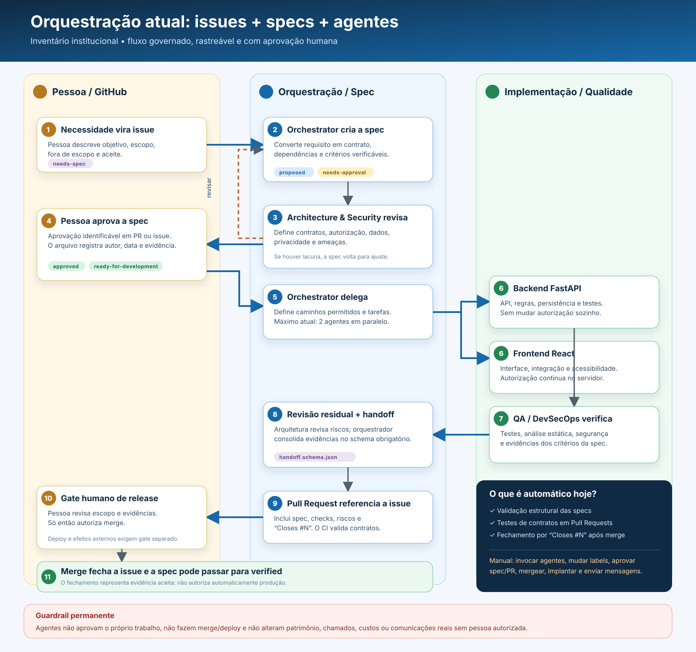

# Fluxo de especificações

Cada mudança funcional começa em uma issue e recebe uma spec versionada antes da
implementação. A issue acompanha o trabalho; o arquivo em `specs/` é o contrato
canônico do comportamento esperado.



Versões do diagrama: [SVG editável](../docs/fluxo-orquestracao-agentes.svg) e
[PNG para visualização](../docs/fluxo-orquestracao-agentes.png).

## Etapas

1. Uma necessidade é registrada em issue com a label `needs-spec`.
2. A spec é criada como `proposed`; a issue passa para `needs-approval`.
3. Os aprovadores humanos revisam escopo, critérios de aceite, dados e autorização.
4. A aprovação é registrada no Pull Request da spec ou em comentário identificável
   na issue. O arquivo passa para `approved` e recebe `ready-for-development`.
5. A implementação referencia a issue e a spec. O Pull Request usa `Closes #N`.
6. QA verifica os critérios. Após revisão humana, a spec passa para `verified` e a
   issue pode ser encerrada.

Editar apenas o campo `approval` não concede autorização: a evidência deve apontar
para uma revisão humana no GitHub. Agentes não aprovam a própria entrega.

## Conteúdo obrigatório

Cada `SPEC-*.md` possui um bloco JSON de metadados e as seções:

- Objetivo;
- Escopo;
- Fora de escopo;
- Contratos e regras;
- Segurança e privacidade;
- Critérios de aceitação;
- Dependências;
- Verificação.

Validação local:

```powershell
python scripts/validate_specs.py
python -m unittest discover -s tests -v
```

As specs 001 a 013 têm aprovação explícita registrada em seus metadados e estão
implementadas. A SPEC-013 usa recomendações determinísticas, permanece desabilitada
até avaliação/ativação explícita e não envia comunicação real.
